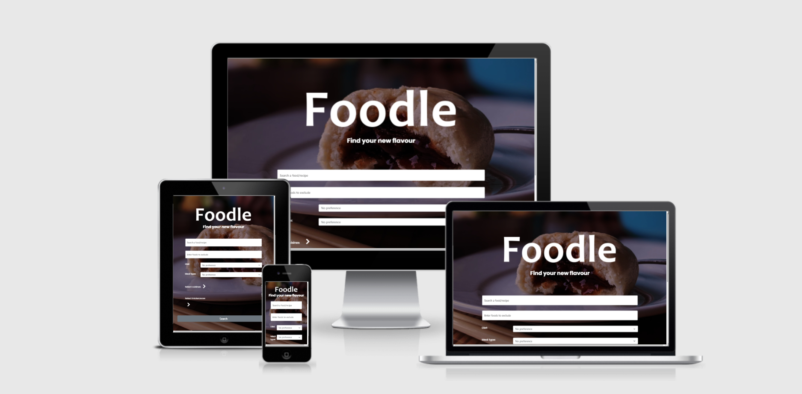

<h1 align="center">Milestone Project 2 - Foodle</h1>

[View the live project here.](https://matttomed.github.io/MS2Foodle/)

For the MS2 brief, I have designed a single-page website that focuses on user responsiveness and interaction to display information based on the user's needs.

I have chosen to use an API that allows me to pull information on recipes based on cuisine, ingredients, dietary requirements and intolerances. The website displays a search in a table format, and allows the user to select a result to see a summary of what they will need to do to recreate the recipe. If errors are thrown resulting in recipe steps not being retrieved, then the website allows for the user to visit the source website. 

The API that is used is the [spoonacular Nutrition, Recipe and Food API.](https://rapidapi.com/spoonacular/api/recipe-food-nutrition/)

# User Experience (UX)

# Strategy plane

## Aims of the website

The identified needs of the site have been measured as below: 

*   Provide users with an easy-to-use recipe search tool
*   Inform users about other external websites for further recipe research
*   Allow users with specific needs to find appropriate recipes
*   Provide users with a way to come back to previous searches if needed

The core aims of the website 

## Competitor analysis

I have based my website on the simplicity of Google's search engine, while also keeping in mind the need for providing a way for users to input specific criteria.

I used other search tools to find ways to add criteria that a iser will find intuitive, such as dropdowns, checkboxes and optional extra fields. 

# Scope plane

*   A single-page website that updates based on the user's need
*   Summary fields that open up when a user wishes to inspect a recipe
*   Design philosophy that is not elaborate and easy to read
*   Use of localStorage and sessionStorage to help with data retention for future visits
*   Lodash usage to provide additional support with array modification

# Structure plane

This website has 1 page, plus a 404 error page if an invalid link is entered. The website will use Bootstrap, Fontawesome, EmailJS, jQuery and Lodash to enhance the website. I wanted to keep the structure clear and simple. Buttons are clearly visible and provide feedback, and the user is always able to conduct another search from the screen if needed.

Summaries and searches can be reset to return the user to the initial website state.

The footer provides an easy way for users to contact the developer by clicking a field at the bottom of the page.

*   Consistency – Pages must look, feel and interact in a consistent way. This applies to link :hover and :active behaviours as well as selecting fields in a table

*   Predictability – The website must respond in a predictable manner - particularly important when users wish to select a recipe for further inspection

*   Learnability – The site's features must be intuitive and feature single-click learning to prevent visitors becoming frustrating and clicking away

*   Visibility – Features must be visible, with content hinting included as appropriate

*   Feedback – Input fields and clickable events should respond in a way that assures the user that an event is progressing. Error message will appear if an API call does not succeed, and will appear if a contact form submission is successful or has otherwise failed. 

**1.  Home - index.html**

    Most of the website's structure is based here. The only time a user will navigate away from this page is if they have attempted to navigate away manually.

    The user will search, browse and research recipes from this page.

**2.  404 - 404.html**

    This page is shown when users enter an invalid link, and contains a link to get back to the intended start point or a contact field to get in touch.

# Skeleton plane

## Wireframes

-   Starting state - [View](docs/wireframes/wireframe1.png)

-   Table of data received from API - [View](docs/wireframes/wireframe2.png)

-   Recipe summary - [View](docs/wireframes/wireframe3.png)

##  Code structure

-   The document will execute code upon startup and implement event listeners for when buttons are clicked to reveal other code elements, such as checkboxes.
-   The function checkPreviousSearchList(keyNumber) will call previous searches from past browsing sessions ready for the user. The function callPreviousSearchResult(id) will then print the selected choice.
-   Upon submitting a search, the function compileUrl() will create a URL to submit to the API using data gathered from the form presented upon the page's initialisation.
-   executeSearch(cb) displays the search result, using a callback to generate the URL needed. displayData() is called to generate a table list of results. Lodash has been used to easily split the array into 10 separate chunks, and pagination generates using createPagination(maxPages) to cycle through results (unless maxPages is only === 1).
-   generateSummary(response) handles the printing of the recipe summary card through using getRecipeInfo(response). Depending on the information received, it prints and organises information from the API. Icons auto-generate if values for vegetarian, vegan, dairy-free or gluten-free are truthy.
-   As the time values are given as integers, convertTime(time) converts time to hours and minutes.
-   removeSearchData() allows users to 'step back', while resetSearch() resets the page to its starting state.
-   nextPage(maxPages) and prevPage() call on the pageNumber stored in sessionstorage to cycle through the active recipeArray generated in executeSearch(cb), also stored to sessionStorage. 
    
# Surface plane

## Colour Scheme
White text will be laid on top of black windows and a dark background to ensure the contrast is maintained.

## Typography
Google's Poppins font is used for most text. Sans serif is used if these fonts are unable to be retrieved.

## Imagery
A background image of a meal is used to add style to the page. The API retrieves a recipe image when a user chooses to look at a recipe summary.

# User stories

## First Time Visitor Goals

1. As a First Time Visitor, I want to search for recipes that I can use according to my specific needs or preferences.
2. As a First Time Visitor, I want to be able to easily find the steps needed to recreate a specific recipe, and find out where the recipe originates from.

## Returning Visitor Goals

1. As a Returning Visitor, I want to be able to return to a previous search and continue using the website.
2. As a Returning Visitor, I want to contact the developer to provide feedback or suggestions for further recipe inclusions.

## Features

-   Responsive on all device sizes

-   Recipe summary card generation customised depending on the recipe searched, with links to external websites. Auto-generated recipes and icons depending on criteria found on the API data.

-   Contact form that is connected my email via EmailJS

-   Recipe saved to localStorage for users to return to upon closing and reopening a browser window

-   Table array displayed upon search submission, with pagination that follows logic to disappear/reappear as appropriate

## Technologies Used

### Languages Used

-   [HTML5](https://en.wikipedia.org/wiki/HTML5)
-   [CSS3](https://en.wikipedia.org/wiki/Cascading_Style_Sheets)
-   [JavaScript](https://en.wikipedia.org/wiki/JavaScript)

### Frameworks, Libraries & Programs Used

1. [Bootstrap 5:](https://getbootstrap.com/)
    - Bootstrap was used to assist with the responsiveness and styling of the website.
1. [Google Fonts:](https://fonts.google.com/)
    - Google Fonts have been used: Poppins.
1. [Font Awesome:](https://fontawesome.com/)
    - Font Awesome has been used for icons used in parts of the site.
1. [jQuery:](https://jquery.com/)
    - jQuery has been used for website responsiveness.
1. [Git](https://git-scm.com/)
    - Git has been used as a version control system, which enables viewers to see the deployment history and design process. Github has been used as a storage for this info.
1. [GIMP:](https://www.gimp.org/)
    - GIMP was used to resize images, export to .jpg and .png and recolour some images.
1. [Balsamiq:](https://balsamiq.com/)
    - Balsamiq has been used for the wireframes attached to this project.
1. [Lodash:](https://lodash.com/)
    - Lodash was implemented to assist with array manipulation when handling API objects.
1. [EmailJS:](https://www.emailjs.com/)
    - EmailJS has been used to provide functionality to the website's contact form.

## Testing

The W3C Markup Validator, W3C CSS Validator and JS Hint services were used to validate every page of the project to ensure there were no syntax errors in the project.

-   [W3C Markup Validator](https://jigsaw.w3.org/css-validator/) - All pages pass with no errors.
-   [W3C CSS Validator](https://jigsaw.w3.org/css-validator/) - CSS file passes with no errors.
-   [JS Hint](https://jshint.com/) - JS file passes with no errors Some variables are used by HTML onclick attributes which are not recognised in this check.

### Testing User Stories from User Experience (UX) Section

-   #### First Time Visitor Goals

    1. As a First Time Visitor, I want to search for recipes that I can use according to my specific needs or preferences.

        The user's first engagement with the website is the logo, the logo header and the search fields that prompt the user for specific information. The user is immedately drawn to the tools needed to search for recipes that they require. Content hinting has been implemented to encourage readers to scroll down.

        Each summary card contains easy to read information using coloured icons at the top of the card. These icons act as 'tags' for the recipe. For example, if a recipe is tagged as a vegetarian recipe by the API, the icon will show. This will inform the user at a glance that the recipe is suitable for vegetarians.

    2. As a First Time Visitor, I want to be able to easily find the steps needed to recreate a specific recipe, and find out where the recipe originates from.

        The website provides a table of results, each with a clickable button that redirects the user to a specific summary card that contains recipe information pulled from the API. The summary contains recipe steps, ingredients and an image, along with a credit to the recipe origin website and a button to direct to the original recipe page should they need more information.

-   #### Returning Visitor Goals

    1. As a Returning Visitor, I want to be able to return to a previous search and continue using the website.

        Searches are stored in localStorage and are contained in a field when a user returns to the website. Up to 5 previous searches are displayed at a time, ordered from most recent downwards. Each previous search is clickable and redirects the user once again to the summary card, without expending an additional API call. Should the user then wish to return to searching, the summary card can be closed without opening up a table array.

    2. As a Returning Visitor, I want to contact the developer to provide feedback or suggestions for further recipe inclusions.

        A contact form has been included at the footer of the page that allows a user to leave messages based on recipe inaccuracies, website improvements or recipe suggestions. These messages are sent to my personal email and trigger successfully. The prompt to click to contact the developer is easy to see and reveals the form upon clicking, which helps avoid cluttering the page too much when adhering to my goal of creating a single-page tool.

### User story illustration of testing

**Please click the screenshots below to see how the website looks at each step through the user journey.**

[Starting state of the website.](docs/screenshots/screenshot1.png)

[Array of search results, with checkboxes revealed.](docs/screenshots/screenshot2.png)

[Recipe summary card with buttons to external website if needed. This opens in a new tab.](docs/screenshots/screenshot3.png)

[Return to the previous search. The information is stored in localStorage for future sessions.](docs/screenshots/screenshot4.png)

[Contact form for submitting info to the developer.](docs/screenshots/screenshot5.png)

[404 page.](docs/screenshots/screenshot6.png)

### Responsiveness

-   The website has been designed with a mobile-first approach, so all fields should be responsive and should provide ease of use on mobile or tablet devices. Images in the summary cards reposition above the ingredient list to allow for text to remain legible.
-   The website operates using Bootstrap's grid system to ensure columns behave appropriately and that sufficient space is used.
-   Fonts scale down depending on the size of the screen used, using @media queries.
-   Search results on smaller screens omit the Preparation Time result to ensure results are still legible. This field can still be checked on the summary card.

### Further Testing

-   The website's pages achieve 90+ scores for Performance, Accessibility, Best Practices and SEO on Google Chrome's Lightbox testing feature.
-   The website has been tested using Chrome Developer Tools to ensure any interactions operate correctly (through manually enabling selectors such as :hover or :active)
-   The website was viewed on desktop and mobile devices.
-   The website has been tested by other people and feedback has been gathered and acted on.

### Further features

-   Future releases can include the ability for users to save recipes that they like to a separate localStorage array. Future releases can also provide functionality for users to email a recipe to someone (or themselves) for future use.

## Credits

### Code

-   [Bootstrap5](https://getbootstrap.com/): The Bootstrap library has been used for its ease in implementing mobile-first design. My custom CSS builds on this to create a website that feels more unique.
-   [EmailJS:](https://www.emailjs.com/): EmailJS has been used to provide functionality to the website's contact form I have used Bootstrap's form design to provide prompts for the user to enter required fields.
-   [Lodash:](https://lodash.com/): Lodash was recommended as a way to make array manipulation easier. This has been used as a way to easily split the results of an array call into separate arrays, which is used as a way for users to cycle through several sets of tabled data.
-   [jQuery:](https://jquery.com/): jQuery has been used for website responsiveness. I opted to use jQuery to make the task of adding and removing HTML elements based on logical arguments an easier task.

## Deployment
### GitHub Pages

This website has been deployed using GitHub Pages.

To deploy a page yourself, do the following:

1. Access your GitHub account and find the relevant repository. If you do not have a Github account, follow the steps to create one.
1. Access the repository you would like to fork. Click 'Settings' in the repository.
1. In Settings, click 'Pages' in the left-hand menu.
1. Scroll down the Settings page to the "GitHub Pages" section and click the option highlighted in orange that takes you to the dedicated tab.
1. Under 'Source', in the dropdown menu displaying 'None', select 'Master Branch'.
1. Select 'Save'. The page will refresh upon completion.
1. At the top of Github Pages you will see a link to your live website.

### Forking the GitHub Repository
To make a clone, or 'fork' this repository, follow the steps below.

1.  Access your GitHub account and find the relevant repository. If you do not have a Github account, follow the steps to create one.
1.  Access the repository you would like to fork. Click on 'Fork' on the top right of the page.
1.  You will find a copy of the repository in your own Github account.

### Making a Local Clone
How to run this project locally:https://github.com/MattTomEd/MS2Foodle

1.  Install the GitPod Browser Extension for Chrome.
1.  After installation, restart the browser.
1.  Access your GitHub account and find the relevant repository. If you do not have a Github account, follow the steps to create one.
1.  Click the green "GitPod" button in the top right corner of the repository. 

### How to run this project within a local IDE, such as VSCode:

1.  Access your GitHub account and find the relevant repository. If you do not have a Github account, follow the steps to create one.
1.  Under the repository name, click 'Clone'.
1.  Copy the clone URL for the repository You can click the clipboard icon to do this, or copy directly.
1.  Using an IDE, open a new terminal window.
1.  Navigate to the directory location where you want the cloned directory to be made.
1.  Type 'git clone', and then paste the URL you copied in Step 3, as shown in the next step:
1. `git clone https://github.com/USERNAME/REPOSITORY  `
1.  Press Enter. Your local clone will be created.

### Content

-   CodeInstitute's sample README was used as a guide on how to document a comprehensive design process, and I used this template to inform the layout of my own design journey.

### Media

-   Images are sourced from the spoonacular API. The background image was taken by myself. All recipes are gained from the API, which in turn has pulled the data from its own list of sources. All sources are currectly attributed on the website summary card, and users can direct to the website through a clickable button.

### Acknowledgements

-   Guido Cecilio for useful and helpful feedback during mentoring sessions.

-   Code Institute for the Slack channel and tutor support when encouring technical issues or sudden Gitpod updates.

-   spoonacular for the API tool that this website has been based on.

-   Slack Exchange for helpful tips on specific questions I had during the creation of this project.
